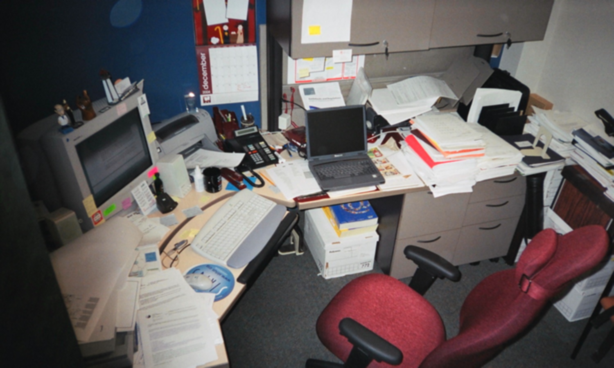
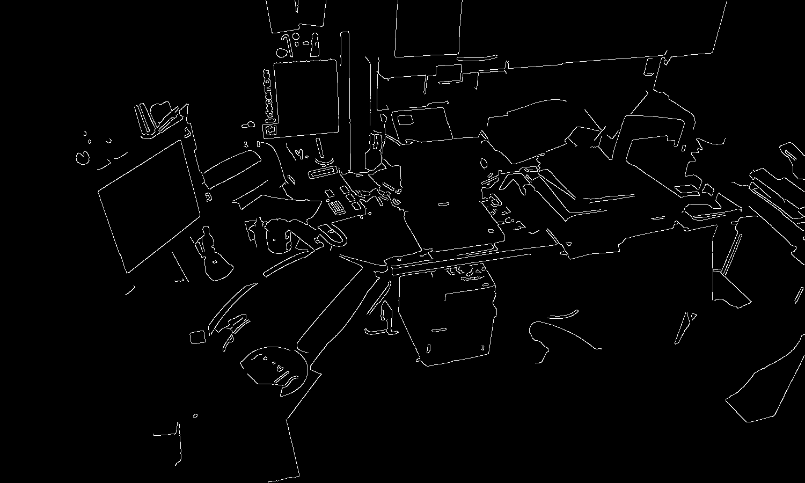
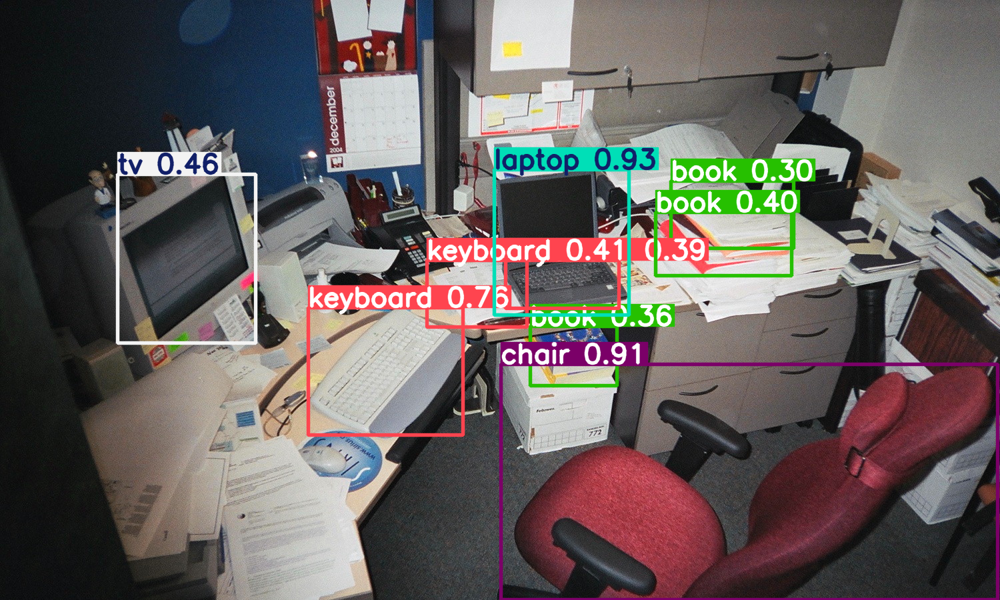

## Ejercicio 1: Procesamiento de Imagen y Detección con YOLO

En este ejercicio se procesó una imagen (`image.jpg`) aplicando tres etapas de tratamiento y luego se utilizó un modelo YOLO para detectar objetos. A continuación se muestran los resultados:

---

### 1. Imagen Original

> **Qué se hizo:**  
> Carga de la imagen tal cual fue proporcionada, sin ningún filtro.  
> Se utiliza para comparar visualmente con las etapas posteriores.

---

### 2. Imagen Suavizada (Gaussian Blur)

> **Qué se hizo:**  
> Se aplicó un filtro de suavizado gaussiano de tamaño \(7\times7\) para atenuar ruido y detalles finos.  
> Esto facilita la detección de bordes y reduce falsas detecciones posteriores.

---

### 3. Bordes Detectados (Canny)

> **Qué se hizo:**  
> Sobre la imagen suavizada se aplicó el detector de bordes **Canny** (umbrales 100–200),  
> resaltando las estructuras más definidas y contornos de objetos.

---

### 4. Detección de Objetos con YOLO

> **Qué se hizo:**  
> Se cargó un modelo preentrenado YOLO (v8 nano, ó v5 nano como fallback) y se ejecutó la inferencia  
> con umbral de confianza 0.25 e IoU 0.45.  
> El cuadro final muestra los `bounding boxes` y las etiquetas de los objetos detectados.

---

> **Archivos generados en** `resultados/`  
> - `suavizado.png`  
> - `bordes.png`  
> - `deteccion_yolo.png`  

Puedes abrir cualquiera de estas imágenes directamente desde la carpeta `resultados/` para revisarlas con más detalle.
