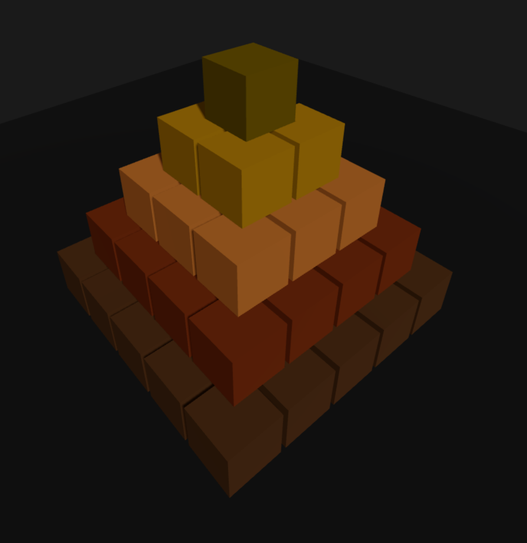

## Ejercicio 2: Pirámide Escalonada 3D con React Three Fiber

Este ejercicio consistió en crear una escena 3D interactiva en React utilizando React Three Fiber (R3F), donde se construyó una pirámide hecha con múltiples cajas (BoxGeometry) y se aplicaron materiales PBR (Physically Based Rendering).

---

### Captura de la Escena 3D

> **Qué se hizo:**  
> - Se construyó una pirámide escalonada de 5 niveles (5x5, 4x4, 3x3, 2x2, 1x1) usando múltiples `BoxGeometry` apilados.  
> - Cada nivel utiliza materiales PBR procedurales con diferentes propiedades: rugosidad, metalness, y emisión.  
> - Se implementó un sistema de iluminación complejo: `DirectionalLight` con sombras, `PointLight` cálida y fría, `SpotLight` cenital, y `AmbientLight`.  
> - Se agregaron controles de cámara `OrbitControls` para navegación 360° con zoom y pan.  
> - Se aplicó una animación sutil de rotación a toda la pirámide.  
> - Materiales van desde piedra rugosa en la base hasta oro brillante metálico en la cima.

---

> **Características técnicas:**  
> - React Three Fiber v8.16+ con React 18  
> - Sombras dinámicas habilitadas (shadow mapping)  
> - Materiales PBR sin texturas externas (procedurales)  
> - Gradiente de materiales: roughness de 0.9 a 0.1, metalness de 0.0 a 0.8  
> - Sistema de iluminación multi-fuente para realismo visual

---

> Puedes interactuar con la escena para rotar, hacer zoom y explorar la pirámide desde distintos ángulos.  
> El proyecto fue desarrollado con Vite + React Three Fiber, implementando las mejores prácticas de renderizado 3D web.

---

