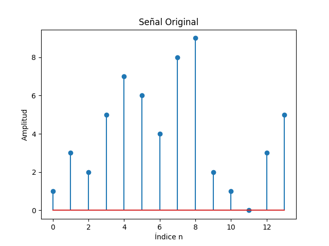
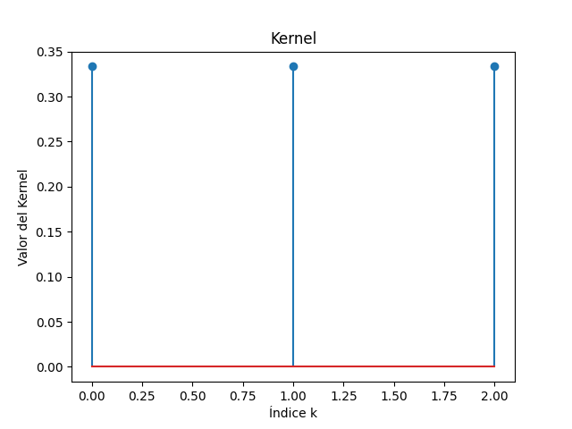
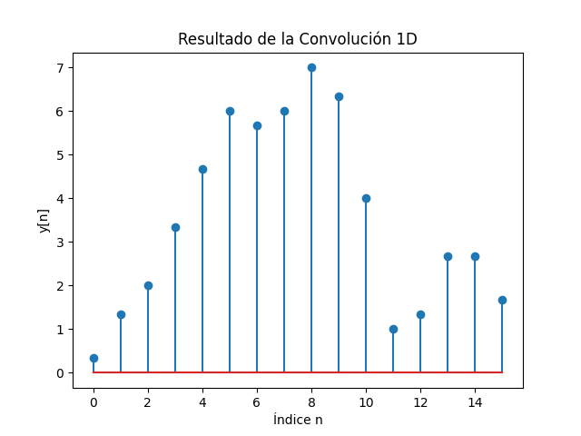

---

## Señal Original



> **Qué se hizo:**  
> Definimos una señal de 14 valores:
> ```python
> signal = [1, 3, 2, 5, 7, 6, 4, 8, 9, 2, 1, 0, 3, 5]
> ```
> Se grafica con `matplotlib.stem` para mostrar amplitud vs. índice discretamente.

---

## Kernel



> **Qué se hizo:**  
> Usamos un kernel de tamaño 3 con valores iguales a 1/3:
> ```python
> kernel = [1/3, 1/3, 1/3]
> ```
> Esto equivale a un filtro promedio móvil de ventana 3.

---

## Resultado de la Convolución 1D



> **Qué se hizo:**  
> La función `convolve_1d(x, h)` se implementa manualmente (padding “full”):
> \[
> y[n] = \sum_{k=0}^{M-1} x[n - k]\;h[k]
> \]
> La salida tiene longitud `len(signal) + len(kernel) - 1`.

---

## Uso

1. Instala dependencias:
   ```bash
   pip install matplotlib
